---
{"title":"Markdown Testing Ground for Published Notes","dg-publish":true,"permalink":"/publish-test/","dgPassFrontmatter":true}
---


| tables            | are        | cool   | how about that |                 |
| ----------------- | ---------- | ------ | -------------- | --------------- |
|                   | how        | cool   | are            | check this out  |
|                   |            |        |                | can we get this |
|                   |            | tables | working go     |                 |
| like what is this | the talbes |        |                |                 |
|                   |            |        |                |                 |


trying out wiki links instead 

[[developer/Digital Gardening/Obisidan Digital Garden\|Obisidan Digital Garden]]

Test from milkywsve 


A collection of all modules to see if they make it to a published sight

> [!note] Here is a callout

> [!warning] Warn Me
> callout warning with a title

==highlighted Text==, *italics*, **Bold**, ~~strike through~~, 

```leaflet
id: leaflet-map
image: [[music/History/_attachments/Pasted image 20221019213517.png]]
height: 500px
lat: 50
long: 50
minZoom: 1
maxZoom: 10
defaultZoom: 8
unit: meters
scale: 1
marker: default, 39.983334, -82.983330, [[Note]]
darkMode: true
```



```mermaid
flowchart TB

noteIds("notesId []")
userId("userId")

subgraph Your DB

	subgraph "User 👨‍🦲"
		id
		noteIds
	end
	
	subgraph "Note 📝"
		id
		userId <--> noteIds
	end
	
end
```

| File                                                                                                                  | Last modified      |
| --------------------------------------------------------------------------------------------------------------------- | ------------------ |
| [[developer/emulation/3DS Crashes on Game Icon hover on Homescreen\|3DS Crashes on Game Icon hover on Homescreen]] | 17.06.2025 - 11:50 |
| [[Personal/EF 2025\|EF 2025]]                                                                                      | 16.06.2025 - 18:55 |
| [[🚿 shower thoughts/Rants/I Told You So Love\|I Told You So Love]]                                                | 16.06.2025 - 14:10 |

{ .block-language-dataview}

## Visual Note link

<div class="transclusion internal-embed is-loaded"><div class="markdown-embed">


[Dunning-Kruger Effect | Psychology Today](https://www.psychologytoday.com/us/basics/dunning-kruger-effect)


> [!quote] The concept of the Dunning-Kruger effect is based on a [1999 paper](https://pdfs.semanticscholar.org/e320/9ca64cbed9a441e55568797cbd3683cf7f8c.pdf) by Cornell University psychologists David Dunning and Justin Kruger. The pair tested participants on their logic, grammar, and [sense of humor](https://www.psychologytoday.com/us/basics/humor "Psychology Today looks at sense of humor"), and found that those who performed in the bottom quartile rated their skills far above average. For example, those in the 12th percentile self-rated their expertise to be, on average, in the 62nd percentile.
>
> The researchers attributed the trend to a problem of [metacognition](https://www.psychologytoday.com/us/basics/cognition "Psychology Today looks at metacognition")—the ability to analyze one’s own thoughts or performance. “Those with limited knowledge in a domain suffer a dual burden: Not only do they reach mistaken conclusions and make regrettable errors, but their incompetence robs them of the ability to realize it,” they wrote. 

### Why do people fail to recognize their own incompetence?
Many people would describe themselves as above average in intelligence, humor, and a variety of skills. They can’t accurately judge their own competence, because they lack _metacognition,_ or the ability to step back and [examine oneself objectively](https://www.psychologytoday.com/us/blog/supersurvivors/201806/why-the-least-competent-people-often-think-theyre-the-best). In fact, those who are the least skilled are also the most likely to overestimate their abilities.

### What is the opposite of the Dunning-Kruger effect?
If the Dunning-Kruger effect is being overconfident in one’s knowledge or performance, its polar opposite is _[[🚿 shower thoughts/Psycology/Imposter Syndrome\|🚿 shower thoughts/Psycology/Imposter Syndrome]]

---
## Backlinks
- [[🚿 shower thoughts/Psycology/Psychology and Me\|🚿 shower thoughts/Psycology/Psychology and Me]]

</div></div>


## Headers

# This is a Heading h1
## This is a Heading h2
###### This is a Heading h6

## Emphasis

*This text will be italic*  
_This will also be italic_

**This text will be bold**  
__This will also be bold__

_You **can** combine them_

## Lists

### Unordered

* Item 1
* Item 2
* Item 2a
* Item 2b

### Ordered

1. Item 1
2. Item 2
3. Item 3
    1. Item 3a
    2. Item 3b

## Images


### Excalidraw


<div class="transclusion internal-embed is-loaded"><div class="markdown-embed">


==⚠  Switch to EXCALIDRAW VIEW in the MORE OPTIONS menu of this document. ⚠==


# Text Elements
dmx 
psu 
top view 
dmx 
psu 
D 
outputs 
input 
5cm 
11.5cm 
22cm 
15cm 
4cm 
20cm 
> 22cm
> 9in 
> 28cm internals 
48.26cm 
3.96cm 
> 48.26cm faceplate 


</div></div>


## Links

You may be using [Markdown Live Preview](https://markdownlivepreview.com/).

## Blockquotes

> Markdown is a lightweight markup language with plain-text-formatting syntax, created in 2004 by John Gruber with Aaron Swartz.
>
>> Markdown is often used to format readme files, for writing messages in online discussion forums, and to create rich text using a plain text editor.

## Tables

| Left columns  | Right columns |
| ------------- |:-------------:|
| left foo      | right foo     |
| left bar      | right bar     |
| left baz      | right baz     |

## Blocks of code

```js
// javascript
let message = 'Hello world';
alert(message);
```

```html
<!-- html  -->
<p> my words are words words words </p>
```

```yml
name:
  work:
    - life
    - is
    - great
```

```bash
#!/bin/bash

# bash
SOURCE="/home/qinton/scripts"

cp $SOURCE ./
```
## Inline code

This web site is using `markedjs/marked`.