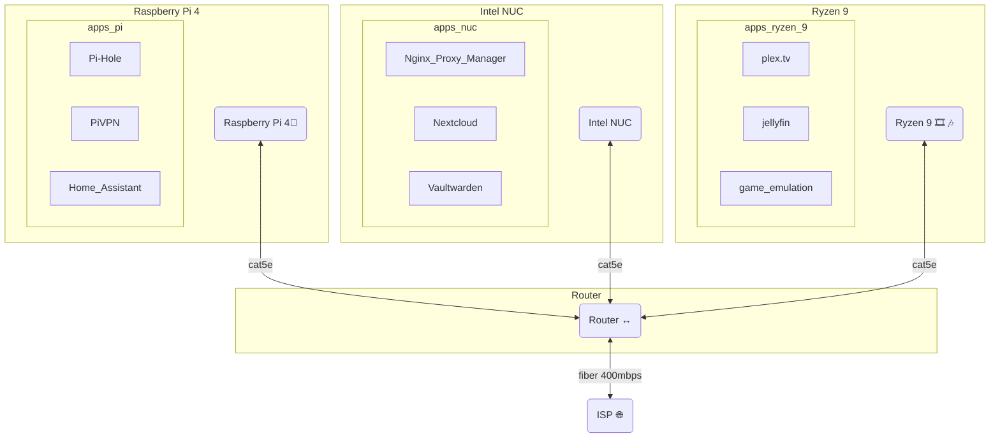

---
{"dg-publish":true,"permalink":"/developer/home-lab/home-lab/","noteIcon":""}
---

## Network Routing

## Pi4 (Debian 11 Bullseye 64bit)
- [[developer/Home Lab 🏠/Glances\|developer/Home Lab 🏠/Glances]]
- [[developer/Home Lab 🏠/Pi-hole\|developer/Home Lab 🏠/Pi-hole]]
	- Unbound DNS
	- DHCP list
- [[developer/Home Lab 🏠/PiVPN\|developer/Home Lab 🏠/PiVPN]]
	- .config files for each client
- [[developer/Home Lab 🏠/DuckDNS\|developer/Home Lab 🏠/DuckDNS]]
- [[developer/Home Lab 🏠/Home Assistant\|developer/Home Lab 🏠/Home Assistant]]
- [[developer/Home Lab 🏠/Hyperion\|developer/Home Lab 🏠/Hyperion]]

---
## Icicle - Intel NUC (Debian 11 Bullseye 64bit)
- [[developer/Home Lab 🏠/Glances\|developer/Home Lab 🏠/Glances]]
- [[developer/Home Lab 🏠/Duplicati\|developer/Home Lab 🏠/Duplicati]]
- [[developer/Home Lab 🏠/SFTP\|developer/Home Lab 🏠/SFTP]]
- [[developer/Home Lab 🏠/Docker\|developer/Home Lab 🏠/Docker]]
	- [[developer/Home Lab 🏠/Nextcloud\|developer/Home Lab 🏠/Nextcloud]]
	- [[developer/Home Lab 🏠/Nginx Proxy Manager\|developer/Home Lab 🏠/Nginx Proxy Manager]]
	- [[developer/Home Lab 🏠/Nginx Proxy Manager\|developer/Home Lab 🏠/Nginx Proxy Manager]]
	- [[developer/Home Lab 🏠/vaultwarden\|developer/Home Lab 🏠/vaultwarden]]
	- [[developer/Home Lab 🏠/Wordpress\|developer/Home Lab 🏠/Wordpress]]
	- [[developer/ReactJS/ReactJS\|developer/ReactJS/ReactJS]]
	- [[developer/Home Lab 🏠/NextJS\|developer/Home Lab 🏠/NextJS]]
	- [[developer/Home Lab 🏠/portainer\|developer/Home Lab 🏠/portainer]]

---
## Spearmint - (custom PC) (Linux Mint)
- [[developer/Home Lab 🏠/Glances\|developer/Home Lab 🏠/Glances]]
- [[developer/Home Lab 🏠/Duplicati\|developer/Home Lab 🏠/Duplicati]]
- [[developer/Home Lab 🏠/Docker\|developer/Home Lab 🏠/Docker]]
	- [[developer/Home Lab 🏠/Plex.tv\|developer/Home Lab 🏠/Plex.tv]]
	- [[developer/Home Lab 🏠/Jellyfin\|developer/Home Lab 🏠/Jellyfin]]
	- [[developer/Home Lab 🏠/portainer\|developer/Home Lab 🏠/portainer]]
- [[developer/Home Lab 🏠/XMRig\|developer/Home Lab 🏠/XMRig]]
- [[developer/Home Lab 🏠/SAMBA\|developer/Home Lab 🏠/SAMBA]]

---
## Frostbyte
- [[developer/Home Lab 🏠/Duplicati\|developer/Home Lab 🏠/Duplicati]] 
- FL Studio
- Davinci Resolve
- Unity3D
- Steam, Epic Games, Battle.net
- [Thunderbird — Make Email Easier. — Thunderbird](https://www.thunderbird.net/en-US/)

---
## Sn0flake
- [[developer/Home Lab 🏠/Duplicati\|developer/Home Lab 🏠/Duplicati]]
- Serato
- [[developer/Home Lab 🏠/Hyperion\|developer/Home Lab 🏠/Hyperion]]
- Unity3D

---
## Milkywave
- [[developer/Home Lab 🏠/Nextcloud\|developer/Home Lab 🏠/Nextcloud]]
- [[developer/Home Lab 🏠/SAMBA\|developer/Home Lab 🏠/SAMBA]]
- [[k9mail.app)](k9mail.app\|K-9 Mail (k9mail.app)]]))

---
#todo
- [ ] Pi4 - backup-dd-n-shrink.sh
- [ ] Zip instead of pi-shrink
- [ ] Pi4 - backup.sh
- [ ] Add hyperion into the mix
- [ ] tryout jellyfin in home assistant integration 

[[developer/Projects📐/Obsidian Publish with NextJS\|developer/Projects📐/Obsidian Publish with NextJS]]
[[developer/Home Lab 🏠/Nginx Proxy Manager\|developer/Home Lab 🏠/Nginx Proxy Manager]]
[[music/Split Skream/Melt & Murder\|music/Split Skream/Melt & Murder]]

## wiki links 
[[developer/Home Lab 🏠/NextJS\|developer/Home Lab 🏠/NextJS]] 

[[developer/Projects📐/Obsidian Publish with NextJS\|developer/Projects📐/Obsidian Publish with NextJS]]
[[myVault/🚿shower_thoughts/In Flavor.md\|In Flavor]]  
[[developer/Home Lab 🏠/Home Lab 🏠\|developer/Home Lab 🏠/Home Lab 🏠]]