---
{"dg-publish":true,"permalink":"/developer/home-lab/nginx-proxy-manager/","noteIcon":""}
---


> Expose your services easily and securely [https://nginxproxymanager.com/](https://nginxproxymanager.com/)

Gotta be honest, writing Nginx code was always a headache, but once I found this I never want to go back. This makes **routing**  **SSL** certificates, and **websockets** a breeze.  

---

## App Network Routing

```mermaid
flowchart TB

%% Hardware
%% rpi("Raspberry Pi 🍓") 
%% ice("Micro services Server")
%% mint("Media Server 💻")
router("Router ↔")
internet("ISP 🌐")

%% Apps
pihole("Pi-Hole 🕳")
vpn("PiVPN 🔐")
ha("Home Assistant 🤖")

nginx("Nginx Proxy Manager")
nextcloud("NextCloud ☁")
vaultwarden("Vaultwarden 🛡")
wordp("Wordpress 🕸")

plex("Plex.tv 📺")
jelly("Jellyfin 🐙")


subgraph Router
	router
end

subgraph "Raspberry Pi 4 🍓"

	pihole <-.-> router
	vpn -.-> pihole
	ha -.-> vpn
end

subgraph Intel NUC

	nginx -.-> pihole
	nextcloud -.-> nginx
	vaultwarden -.-> nginx
	wordp -.-> nginx
end

subgraph Ryzen 9 

	plex -.-> nginx
	jelly -.-> nginx
end


router <-- fiber 400mbps --> internet


```


### connections
- [[developer/Home Lab 🏠/Pi-hole\|developer/Home Lab 🏠/Pi-hole]] for local DNS. Make pretty URLs for local or public services

### installation
1. `compose.yml` via [[developer/Home Lab 🏠/Docker\|developer/Home Lab 🏠/Docker]] 
```yaml
version: '3'
services:
  app:
    image: 'jc21/nginx-proxy-manager:latest'
    restart: unless-stopped
    ports:
      - '80:80'
      - '81:81'
      - '443:443'
    volumes:
      - ./data:/data
      - ./letsencrypt:/etc/letsencrypt
      - ./css:/app/frontend/css # if you want to tweak the css for dark mode B-)
```

Default Admin User:
```
Email:    admin@example.com
Password: changeme
```

---
## Publicly Facing Apps
1. [[developer/Projects📐/WilliaMusic.com\|developer/Projects📐/WilliaMusic.com]]
2. [[developer/Home Lab 🏠/Nextcloud\|developer/Home Lab 🏠/Nextcloud]]
3. [[developer/Projects📐/heart-chart\|developer/Projects📐/heart-chart]]
4. [[developer/Home Lab 🏠/vaultwarden\|developer/Home Lab 🏠/vaultwarden]]
5. [[developer/Home Lab 🏠/PhotoPrism\|developer/Home Lab 🏠/PhotoPrism]]
6. [[developer/Home Lab 🏠/Plex.tv\|developer/Home Lab 🏠/Plex.tv]]
7. [[developer/Home Lab 🏠/Jellyfin\|developer/Home Lab 🏠/Jellyfin]]

## Pretty URLs for Local Apps
1. [[developer/Home Lab 🏠/Pi-hole\|developer/Home Lab 🏠/Pi-hole]] DNS setup
2. **Nginx** to link Port number 

## Leveraging Docker's Internal DNS routing
for example [[developer/Home Lab 🏠/vaultwarden\|developer/Home Lab 🏠/vaultwarden]] I do *not* specify a `port` number. instead I use the `container_name: vaultwarden` as a DNS entry I can use in **Nginx Proxy Manager** 

## Dark Mode
There isn't an official dark mode, but with a bit of file digging, you too can override the `main.css` 

*check the `compose.yml` to map the `app/frontend/css/main.css` to a persistent volume*

add this to the bottom of  `main.css`
```css
body, .modal-content{
  background-color: #635366;
  color: white;
 }

 .modal-content{
  box-shadow: black 2px 2px 8px;
 }

 .custom-switch-description{
    color: #c3c3c3;
  }

 #header{
  background-color: #323232;
 }
 .navbar-light .navbar-brand{
  color: white;
 }
 #menu{
  background-color: #000;
 }

 .text-default {
    color: white !important;
  }

  .tag{
    background-color: #545454;
    color: white;
  }

 .card{
    background-color: #29292a;
    box-shadow: black 2px 2px 8px;
  }

  .table thead {
    border-bottom: solid black 3px;
  }
  .table th, .text-wrap table th, .table td, .text-wrap table td{
    border-top: 1px solid #000000;
    border-top-width: 1px;
    border-top-style: solid;
    border-top-color: rgb(0, 0, 0);
  }
```

---

#todo 
- [ ] explain how you set up router to forward port 80 & 443
- [ ] explain using domain name and IP address
- [ ] show how to connect pi-hole to give any service a pretty URL
- [ ] finish "publicly facing app"
- [ ] finish "pretty urls for ..."